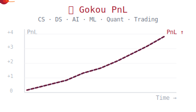

  

<table>
<tr>
<td width="60%">
<h2>👋 Hi, I'm Ming!</h2>
  <ul>
    <li>🚀 <strong>Founder:</strong> Building an AI startup at the intersection of ML & Quant Finance.</li>
    <li>💹 <strong>Focus:</strong> Quant Strategies, Trading Systems, and MLOps.</li>
    <li>🌍 <strong>Global:</strong> CN · SG · US · UK</li>
    <li>🌐 <strong>More About Me:</strong> <a href="https://www.seas.upenn.edu/~xiaming/">My Portfolio</a></li>
    <li>💼 Tech enthusiast and entrepreneur </li>
    </ul>
    </td>
    <td width="50%" align="center">
      
    </td>
  </tr>
</table>

<table>
<tr>
  <td valign="top" width="60%">
    <h2>🛠 Skills & Arsenal</h2> 
      
      
      
      
      
      
      
      
      
      
      
      
      
      
      
      
      
      
      
      
      
      
      
      
      
      
      
      
      
      
      
      
      
      
      
      
      
      
      
      
      
      
      
      
      
      
      
      
      
      
      
      
      
      
  </td>
  <td valign="center" width="40%">
    

      
        
      
    

  </td>
</tr>
</table>

## 📡 Network & Socials

  
    
    &nbsp;&nbsp;
    
    &nbsp;&nbsp;
    
  

