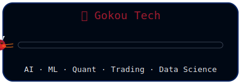

  

## 👋 Hi, I'm Ming!
**Harvard DS | UPenn AI | WSU CS**  
**CS · DS · ML · AI · Quant Trading · Finance**

- 🌍 **Location:** China · USA · UK · Singapore  
- 🌐 **More About Me:** [My Portfolio](https://www.seas.upenn.edu/~xiaming/)  
- 🚀 **Building an AI startup** at the intersection of machine learning, finance, and quantitative trading  
- 💹 Love exploring **quant strategies, trading systems, and data-driven investing**  
- 🤖 **Machine Learning · Data Science · AI Engineering · MLOps**  
- 💼 Tech enthusiast and entrepreneur

## 🔧 Skills

## 📊 My GitHub

  
  &nbsp;&nbsp;&nbsp;
  

## 💬 Let's Connect

  
    
    &nbsp;&nbsp;
    
    &nbsp;&nbsp;
    
  

